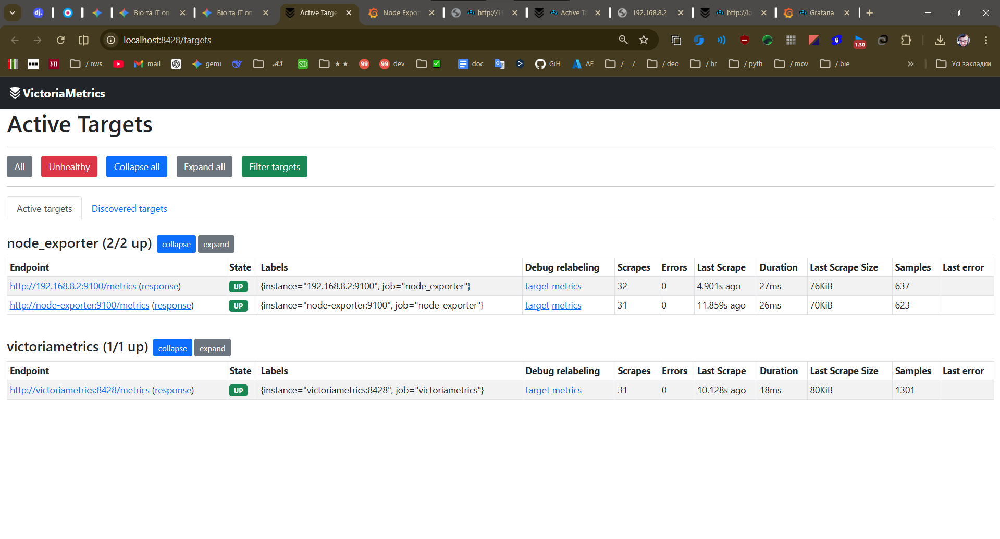

# Lightweight On-Premise Monitoring Stack

## Overview
This repository contains an Infrastructure as Code (IaC) setup for a high-performance, lightweight monitoring stack designed for on-premise infrastructure. It utilizes **VictoriaMetrics** as a highly efficient drop-in replacement for Prometheus, capable of handling large-scale metrics with lower memory/CPU consumption, paired with **Grafana** for data visualization.

The stack is configured to scrape hardware and OS metrics via **Node Exporter** from both the local Docker host and remote on-premise virtual machines (e.g., Oracle Linux/RHEL).

## Architecture
The monitoring pipeline consists of three main components:
1. **Node Exporter:** Deployed as a Docker container (for local host metrics) and as a Systemd service (for remote on-premise servers).
2. **VictoriaMetrics:** Time-series database that scrapes endpoints defined in the `prometheus.yml` configuration.
3. **Grafana:** Connects to VictoriaMetrics via the Prometheus API to visualize infrastructure health.

## Repository Structure
- `docker-compose.yml` - Defines the containerized infrastructure (VictoriaMetrics, Node Exporter, Grafana).
- `prometheus.yml` - Defines scraping jobs and target endpoints (Local & Remote IPs).
- `/dashboards/` - Exported JSON models for pre-configured Grafana dashboards.

## Quick Start (Deployment)

### 1. Clone the repository
\`\`\`bash
git clone https://github.com/your-username/on-premise-monitoring-stack.git
cd on-premise-monitoring-stack
\`\`\`

### 2. Start the stack
Deploy the monitoring environment using Docker Compose:
\`\`\`bash
docker compose up -d
\`\`\`

### 3. Access Grafana
- Navigate to `http://localhost:3000`
- **Default Credentials:** `admin` / `admin`
- Import the provided dashboard from `/dashboards/node-exporter.json` or use Grafana ID `1860`.

## Adding Remote On-Premise Servers (e.g., Oracle Linux 9)
To monitor additional on-premise servers, install Node Exporter on the target machine as a `systemd` service and open the required firewall ports:
\`\`\`bash
# On RHEL/Oracle Linux target:
sudo firewall-cmd --add-port=9100/tcp --permanent
sudo firewall-cmd --reload
\`\`\`
Then, add the target IP to `prometheus.yml` and restart the VictoriaMetrics container:
\`\`\`yaml
static_configs:
  - targets: ['node-exporter:9100', '<REMOTE_IP>:9100']
\`\`\`

## Screenshots

